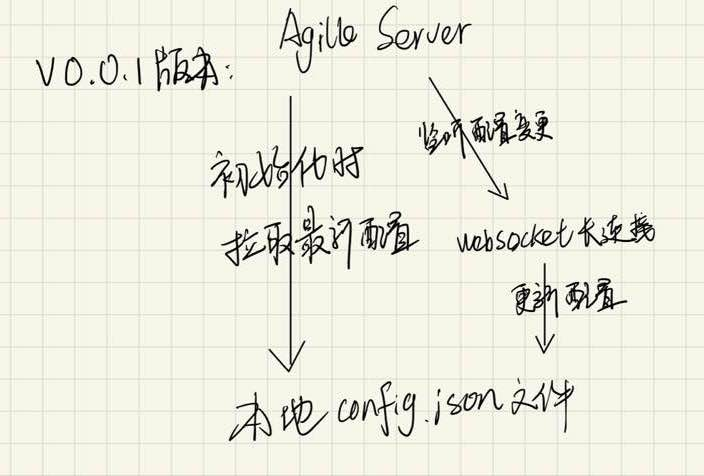

# node-agile-client
AgileConfig（配置中心）的node客户端

# Introduction
AgileConfig是一个基于.net core开发的轻量级配置中心。 AgileConfig秉承轻量化的特点，部署简单、配置简单、使用简单、学习简单，它只提取了必要的一些功能，并没有像Apollo那样复杂且庞大。但是它的功能也已经足够你替换webconfig，appsettings.json这些文件了。如果你不想用微服务全家桶，不想为了部署一个配置中心而需要看N篇教程跟几台服务器那么你可以试试AgileConfig ：）

本项目为Node.js 客户端,工作原理如下：


# Usage
## Install
```bash
npm i node-agile-client
```
## Init
在你的node项目初始化的时候初始化`node-agile-client`
```javascript
import { init } from 'node-agile-client';

init({
  appid: 'testProject',
  secret: '123456',
  node: 'http://192.168.1.1',
  env: 'DEV'
});
```
| 参数名         | 含义                                |         
| ------------- | ---------------------------------- | 
| appid         | 配置中心的应用id                      |  
| secret        | 配置中心的应用密钥                     |  
| node          | 配置中心的服务端节点地址，支持多节点配置没，例如['http://192.168.1.1','http://192.168.1.2']|  
| env           | 访问环境，DEV,TEST,STAGING,PROD      |                 

## Use
```javascript
import { getAgileConfig } from 'node-agile-client';

const { token, url } = getAgileConfig();
```
# Changelog
## v0.0.1
- 支持多节点获取配置
