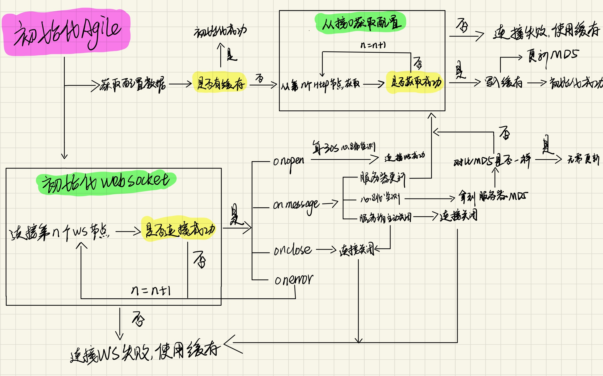

# node-agile-client
AgileConfig（配置中心）的node客户端

# Introduction
[AgileConfig](https://github.com/dotnetcore/AgileConfig) 是一个基于.net core开发的轻量级配置中心。 AgileConfig秉承轻量化的特点，部署简单、配置简单、使用简单、学习简单，它只提取了必要的一些功能，并没有像Apollo那样复杂且庞大。但是它的功能也已经足够你替换webconfig，appsettings.json这些文件了。如果你不想用微服务全家桶，不想为了部署一个配置中心而需要看N篇教程跟几台服务器那么你可以试试AgileConfig ：）

本项目为Node.js 客户端,工作原理如下：


# Features
- 支持缓存获取配置配置
- 支持websocket长连接定时获取配置
- websocket/http连接失败时降级使用缓存配置
- 多节点重试机制
# Usage
## Install
```bash
npm i node-agile-client
```
## Init
在你的node项目初始化的时候初始化`node-agile-client`
```javascript
import { init } from 'node-agile-client';

init({
  appid: 'app',
  secret: 'xxx',
  node: 'http://192.168.1.1,http://192.168.1.2',
  env: 'DEV',
  tag: '',
  name: '',
  httptimeout: 100,
  debug: false,
});
```
|配置项名称|数据类型|配置项说明|是否必填|备注|
|--|--|--|--|--|
|appid|string|应用ID|是|对应后台管理中应用的`应用ID`|
|secret|string|应用密钥|是|对应后台管理中应用的`密钥`|
|nodes|string|应用配置节点|是|存在多个节点则使用逗号`,`分隔|
|env|string|配置中心的环境|否|通过此配置决定拉取哪个环境的配置信息；如果不配置，服务端会默认返回第一个环境的配置|
|name|string|连接客户端的自定义名称|否|方便在agile配置中心后台对当前客户端进行查阅与管理|
|tag|string|连接客户端自定义标签|否|方便在agile配置中心后台对当前客户端进行查阅与管理|
|httptimeout|number|http请求超时时间|否|配置 client 发送 http 请求的时候的超时时间，默认100000(100秒)|                                                   |
|debug|boolean|debug模式|否|打印更多信息|                                                   |

## Use
```javascript
const { getAgileConfig }  = require('node-agile-client');

const { token, url } = getAgileConfig();
```


# Changelog
## v0.0.3
- typescript改造
- 支持cjs和esm5使用
- 修复第一次启动报错的问题
## v0.0.2
- 通过md5优化获取配置的逻辑，减少配置中心的访问次数
## v0.0.1
- 支持多节点获取配置和websocket长链接监听
